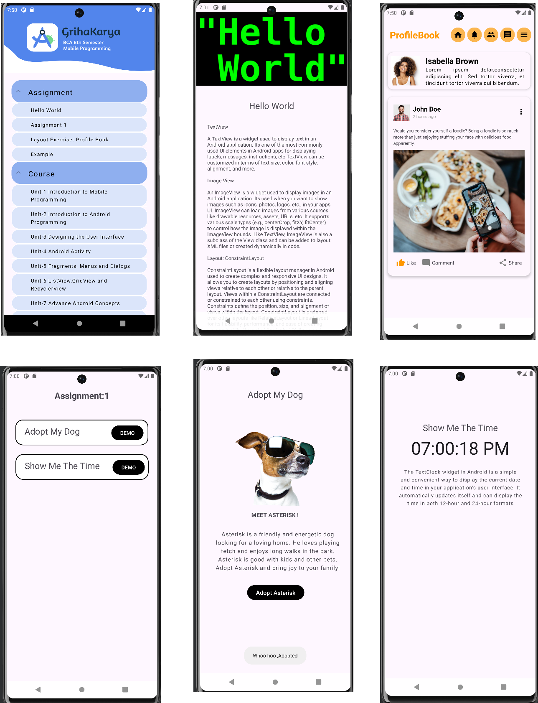

# Grihakarya - Learn Android Programming App

Grihakarya is a mobile app designed to help BCA students and Android programming enthusiasts learn Android development. It covers the syllabus of the BCA 6th semester, providing comprehensive notes and tutorials for units 1 to 8.

- **Comprehensive Coverage**: Notes and tutorials on all units from the BCA 6th semester syllabus (Unit 1 to 8).

## Contributing

Contributions are welcome! If you want to contribute to Grihakarya

# OutPut

